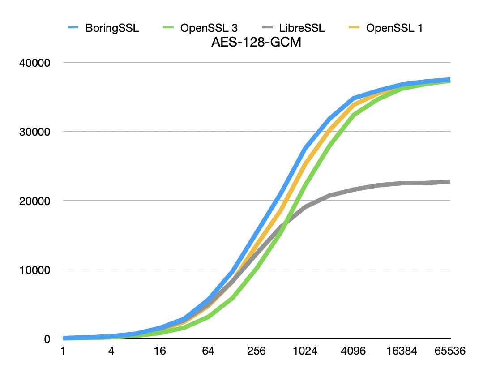
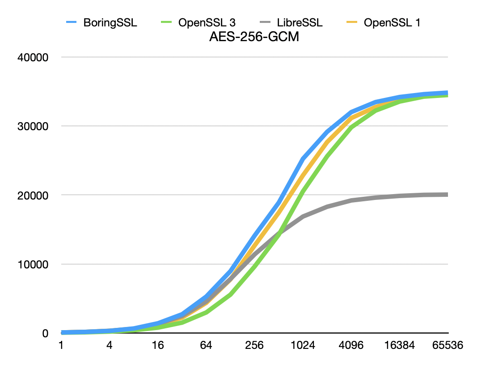
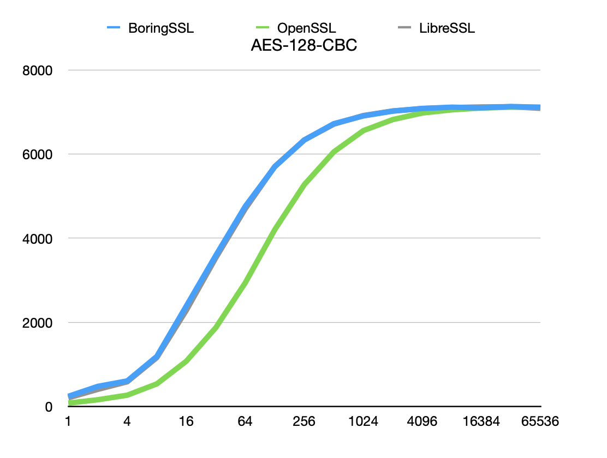
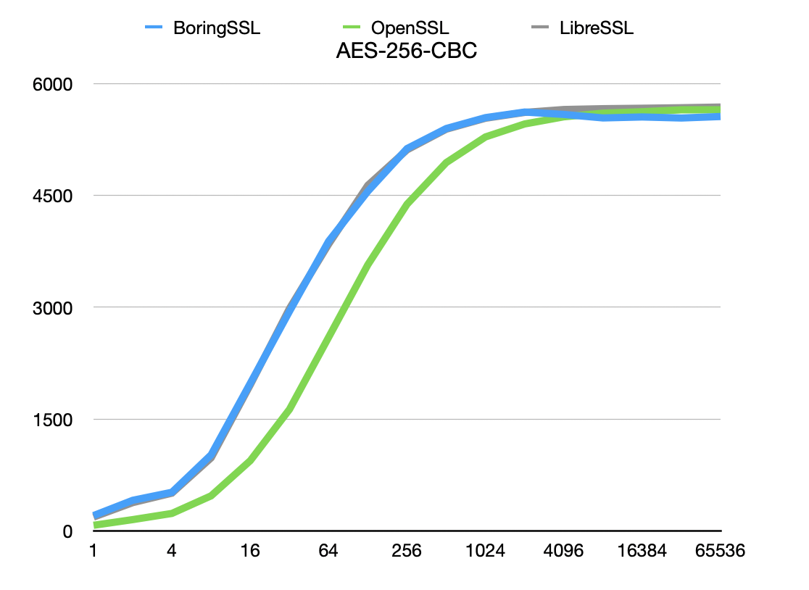
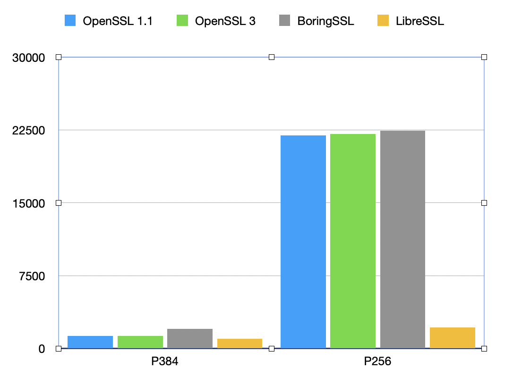
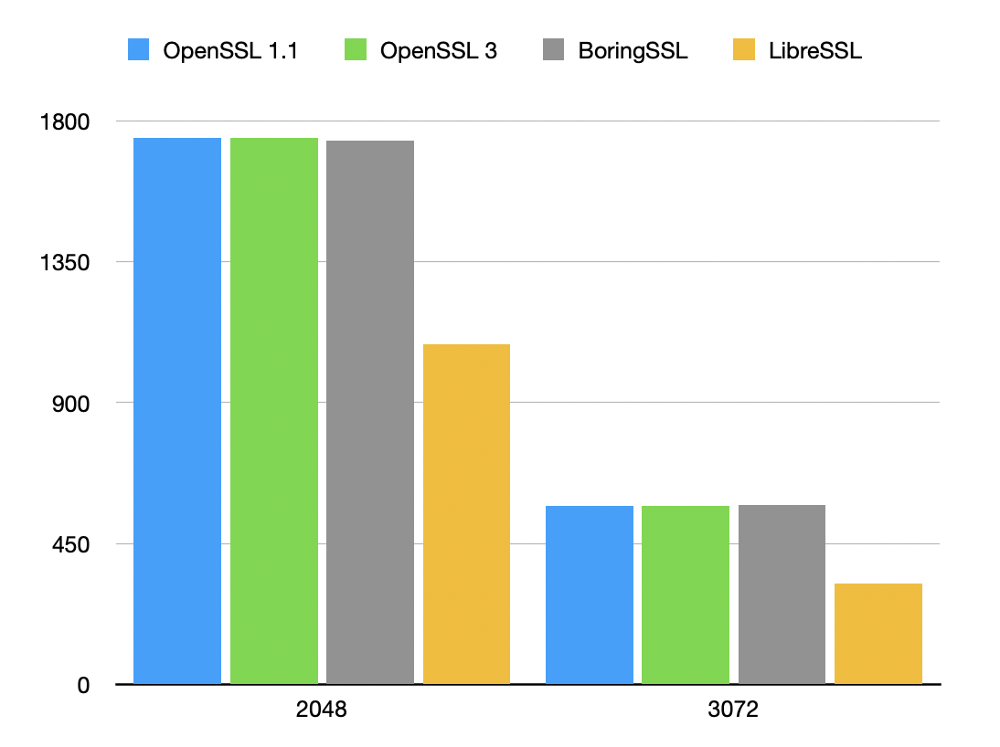
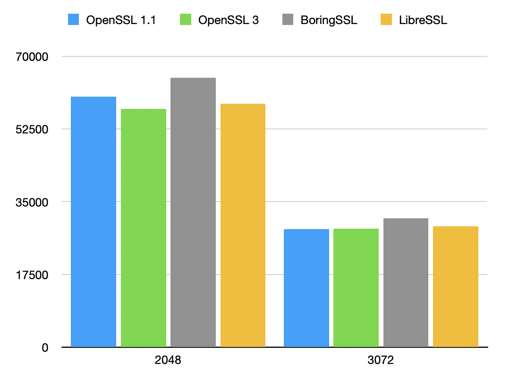
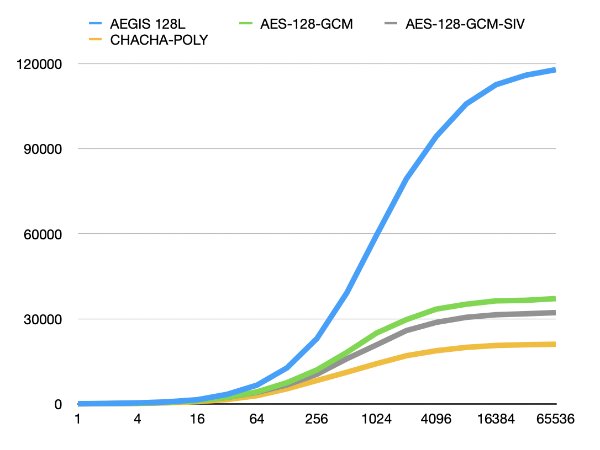

# {Open|Libre|Boring}SSL benchmark

A simple benchmark of common symmetric primitives.

[Source code](cryptobench.c)

Benchmarked on a [Scaleway PRO 2](https://www.scaleway.com/en/virtual-instances/pro2/) instance (AMD 3rd Gen EPYC™ 7003).

* OpenSSL 3.0.2 (Ubuntu Jammy package)
* OpenSSL 1.1.1q
* LibreSSL 3.5.3
* BoringSSL b819f7e9392d25db6705a6bd3c92be3bb91775e2

Inputs have a 13 bytes of additional data in order to mimic typical TLS messages.

## Results

X axis is the block size.

Y axis is the throughput in Mib/s. Higher is better.

## Key exchange

ECDH over p256 and p384 ([Source code](cryptobench-ecdh.c))

## RSA

### RSA signature ([Source code](cryptobench-rsa.c))

### RSA verification ([Source code](cryptobench-rsa-verification.c))

## Comparing BoringSSL AEADs

[Source code](cryptobench-aegis.c), linked against BoringSSL with [AEGIS-128L](https://github.com/jedisct1/boringssl/tree/aegis) support.

Uses BoringSSL's dedicated AEAD API. Higher is better.

